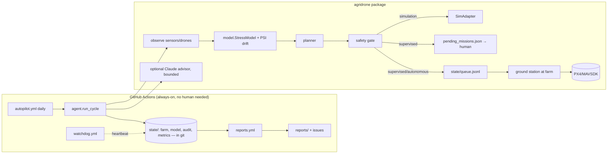

# Architecture

| PRD item | Status here |
|---|---|
| Crop health monitoring | ✅ simulated NDVI/moisture/pest + classifier |
| Drone coordination | ✅ multi-drone planner, battery + altitude-layer separation |
| Safety/compliance | ✅ no-fly cells, reserve, kill switch, audit log |
| Adaptive ML pipeline | ✅ drift (PSI) + accuracy-triggered retraining, canary promote |
| LLM command & control | ✅ bounded advisor (optional); flight commands never LLM-originated |
| Reports | ✅ weekly/monthly, auto-published as issues |
| Dashboard | ✅ static `docs/dashboard.html` (KPIs, NDVI heatmap, audit feed), regenerated each cycle; Mapbox/React UI later |
| Real drones | 🟡 PX4/MAVSDK adapter + unattended ground station built and unit-tested with a fake vehicle; validated on PX4 SITL, **not yet on real hardware**; payload stubbed (docs/GROUND_STATION.md) |
| Edge IoT / real imagery | ⏳ needs hardware |
| AWS/K8s/Terraform | ⏳ deliberately not provisioned (cost + credentials); Dockerfile is ready |

## Path to production
1. Hardware pilot (1 km²) with a PX4 adapter in `supervised` mode.
2. Replace `sim.py` observations with real multispectral ingestion; replace the logistic model with a PyTorch/ONNX CNN behind `StressModel`'s interface.
3. Containerise (Dockerfile) → EKS/GKE via Terraform once a human approves spend.
4. Regulatory: drone operations (FAA Part 107/137 or local), pesticide-application rules.

## Honest limits
Yield/water/chemical figures are **simulator outputs**, not field evidence. The 20–30% yield and 30–50% savings goals are unvalidated until a real pilot.

## Model quality notes (stress classifier)
Measured with `scripts/eval_model.py` (60 days x 5 seeds, scored against the *whole field*, not the agent's own sample):

| | before | after |
|---|---|---|
| mean balanced accuracy | 0.75 | 0.91 |
| worst outbreak-day recall | 0.00 (missed every stressed cell) | 0.60 |
| pooled recall | n/a | 0.92 |

Root causes fixed: one-class cold start (a model that learned "everything is fine" scored 100%); evaluating on training data;
plain accuracy rewarding never flagging anything; rare positives evicted by a FIFO buffer; a linear model that cannot represent
"too dry OR too infested"; a shortcut on raw NDVI (it trends up with crop growth, now NDVI anomaly vs field median);
a stale evaluation set that hid the problem; and a planner that depended on the model (thresholds now always act).
Honest ceiling: sensor noise (+-0.02) at the decision thresholds limits any detector to ~0.885 balanced accuracy in this
simulator, so the 90% target sits at the noise limit. Labels in the simulator come from the same threshold rule as the
seed set, so real agronomist labels will be harder.
