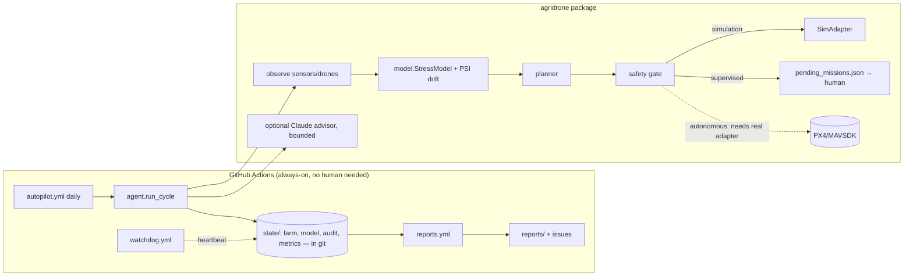

# Architecture

| PRD item | Status here |
|---|---|
| Crop health monitoring | ✅ simulated NDVI/moisture/pest + classifier |
| Drone coordination | ✅ multi-drone planner, battery + altitude-layer separation |
| Safety/compliance | ✅ no-fly cells, reserve, kill switch, audit log |
| Adaptive ML pipeline | ✅ drift (PSI) + accuracy-triggered retraining, canary promote |
| LLM command & control | ✅ bounded advisor (optional); flight commands never LLM-originated |
| Reports | ✅ weekly/monthly, auto-published as issues |
| Dashboard | ✅ static `docs/dashboard.html` (KPIs, NDVI heatmap, audit feed), regenerated each cycle; Mapbox/React UI later |
| Edge IoT, real drones | ⏳ adapter interface only; needs hardware |
| AWS/K8s/Terraform | ⏳ deliberately not provisioned (cost + credentials); Dockerfile is ready |

## Path to production
1. Hardware pilot (1 km²) with a PX4 adapter in `supervised` mode.
2. Replace `sim.py` observations with real multispectral ingestion; replace the logistic model with a PyTorch/ONNX CNN behind `StressModel`'s interface.
3. Containerise (Dockerfile) → EKS/GKE via Terraform once a human approves spend.
4. Regulatory: drone operations (FAA Part 107/137 or local), pesticide-application rules.

## Honest limits
Yield/water/chemical figures are **simulator outputs**, not field evidence. The 20–30% yield and 30–50% savings goals are unvalidated until a real pilot.
