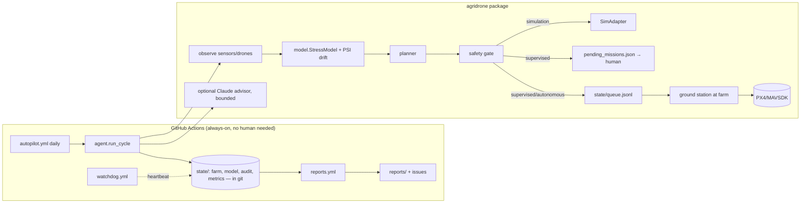

# Architecture

| PRD item | Status here |
|---|---|
| Crop health monitoring | ✅ simulated NDVI/moisture/pest + classifier |
| Drone coordination | ✅ multi-drone, multi-sortie planner (cheapest insertion + 2-opt, battery swaps, forecast-aware, no-fly detours); altitude-layer separation |
| Safety/compliance | ✅ no-fly cells **and flight legs**, battery reserve, kill switch, audit log, policy validation |
| Adaptive ML pipeline | ✅ drift (PSI) + accuracy-triggered retraining, canary promote |
| LLM command & control | ✅ bounded advisor (optional); flight commands never LLM-originated |
| Reports | ✅ weekly/monthly, auto-published as issues |
| Dashboard | ✅ static `docs/dashboard.html` (KPIs, NDVI heatmap, audit feed), regenerated each cycle; Mapbox/React UI later |
| Real drones | 🟡 PX4/MAVSDK adapter + unattended ground station built and unit-tested with a fake vehicle; validated on PX4 SITL, **not yet on real hardware**; payload stubbed (docs/GROUND_STATION.md) |
| Edge IoT / real imagery | ⏳ needs hardware |
| AWS/K8s/Terraform | ⏳ deliberately not provisioned (cost + credentials); Dockerfile is ready |

## Path to production
1. Hardware pilot (1 km²) with a PX4 adapter in `supervised` mode.
2. Replace `sim.py` observations with real multispectral ingestion; replace the logistic model with a PyTorch/ONNX CNN behind `StressModel`'s interface.
3. Containerise (Dockerfile) → EKS/GKE via Terraform once a human approves spend.
4. Regulatory: drone operations (FAA Part 107/137 or local), pesticide-application rules.

## Honest limits
Yield/water/chemical figures are **simulator outputs**, not field evidence. The 20–30% yield and 30–50% savings goals are unvalidated until a real pilot.

## Model quality notes (stress classifier)
Measured with `scripts/eval_model.py` (60 days x 5 seeds, scored against the *whole field*, not the agent's own sample):

| | before | after |
|---|---|---|
| mean balanced accuracy | 0.75 | 0.91 |
| worst outbreak-day recall | 0.00 (missed every stressed cell) | 0.60 |
| pooled recall | n/a | 0.92 |

Root causes fixed: one-class cold start (a model that learned "everything is fine" scored 100%); evaluating on training data;
plain accuracy rewarding never flagging anything; rare positives evicted by a FIFO buffer; a linear model that cannot represent
"too dry OR too infested"; a shortcut on raw NDVI (it trends up with crop growth, now NDVI anomaly vs field median);
a stale evaluation set that hid the problem; and a planner that depended on the model (thresholds now always act).
Honest ceiling: sensor noise (+-0.02) at the decision thresholds limits any detector to ~0.885 balanced accuracy in this
simulator, so the 90% target sits at the noise limit. Labels in the simulator come from the same threshold rule as the
seed set, so real agronomist labels will be harder.

## Benchmark
`scripts/benchmark.py`: 120-day season, 576 patches, 6 random farms. Every strategy sees **identical weather** (environment and
sensor noise use separate random streams), so differences come only from what each strategy does. Yield index 1.00 = no crop loss.

<!-- BENCH:START -->
| Strategy | Yield | Water (mm/patch) | Sprays/patch | Flight hours |
|---|---|---|---|---|
| Do nothing | 87.9% ± 6.4 | 0 | 0.0 | - |
| Fixed schedule | 100.0% ± 0.0 | 612 | 8.0 | - |
| Smart farmer (sensor triggers, no drones) | 99.6% ± 0.1 | 144 | 1.0 | - |
| AI agent, rules only | 99.5% ± 0.2 | 110 | 0.56 | 44.9 |
| AI agent, 1 flight/day | 95.5% ± 4.3 | 57 | 0.71 | 25.7 |
| AI agent, 3 flights/day | 99.4% ± 0.3 | 110 | 0.66 | 46.6 |
<!-- BENCH:END -->

- The AI crew keeps **99.7% of the fixed schedule's yield with ~79% less water and ~92% fewer sprays**; doing nothing loses ~12% of the crop.
- **Capacity matters:** one flight/day per drone cannot keep up with a dry spell (96% yield); with battery swaps (3 flights/day) a 3-drone fleet reaches the plateau (backlog -> ~0).
  Beyond that, yield no longer improves with more drones.
- **The ML model adds almost nothing here** (+0.04 yield points over plain threshold rules; better on 6/6 farms). In this simulator stress *is* a clean threshold on the same sensors.
  Its value would appear where stress is not a simple threshold; that cannot be shown without real data. The rules always act regardless of the model (fail-safe).
- **Sensor faults (4% of sensors dead/stuck/biased/spiking):** without the quality layer the fleet wastes ~29% extra water (184 vs 131 mm) for no yield benefit.
  Detector recall (`scripts/eval_quality.py`): dead 1.00, stuck 0.98, spiking 0.79, **biased 0.53** (a persistent offset is hard to tell from irrigation/soil variation
  without a second sensor or scouting measurements), false alarms 0.02%.
- Action thresholds are the farmer's water-vs-yield knob (`scripts/sweep_thresholds.py`): acting at 0.30 moisture / 0.45 pests (just before damage starts) reaches 0.997 yield; more eager settings buy ~0.1% yield for 25% more water.

### Limits of these numbers
Simulator physics are simplified (single crop, one soil layer, no wind/disease/hail, drone treatment instantly effective). Weather is a synthetic seasonal generator unless
`weather.source` is `open-meteo`. Sensor noise (+-0.02 at decision thresholds) caps any detector at ~0.885 balanced accuracy. **None of this is field evidence.**

## Reliability & engineering
- Policy is schema-validated on every load; the autopilot runs the test suite first, validates policy, runs the cycle, **verifies state integrity before committing**, and opens an incident issue on failure.
- Versioned state migration (`state/version.json`): a simulator upgrade archives old state instead of silently mixing models.
- CI: ruff lint + format, tests on Python 3.11/3.12/3.13 with an 85% coverage gate (currently 95%), bandit (medium+ fails), pip-audit, Docker build + run as non-root.
- Planner: incremental insertion cost with cached leg costs; 300+ candidate patches planned in ~0.5 s.

## Airspace safety (drones must never clash)
Altitude layers alone only protect drones in *level* flight; the dangerous moments are climbs, descents and overflights of a pad.
`traffic.py` therefore enforces four layers, and the safety gate (`safety.validate`) re-verifies them on every plan:
1. **One launch pad per drone**, `pad_spacing_m` (40 m) apart (policy-validated to be >= 1.5x the clearance).
2. **Distinct cruise altitudes** for drones flying together, >= `min_separation_m` (15 m) apart.
3. **A time-resolved 3D replay**: each mission's full trajectory (climb, legs, hover, detours, return, hold, descent, with real speeds) is stepped
   second by second for all drones flying together. A *conflict* is both closer than `horizontal_clearance_m` (20 m) sideways **and** closer than
   15 m vertically at the same instant. Any conflict rejects the plan.
4. **A scheduler** staggers launches (highest altitude first) and adds pre-landing holds until the replay shows zero conflicts. If no concurrent
   schedule exists it **flies one drone at a time**, which cannot overlap in time and is safe by construction.

Hardware modes plan one sortie and allow launch stagger only (no holds: return-to-launch timing cannot be delayed); the ground station sleeps each drone's
`t0` on the ground before connecting, and the preflight refuses any plan that needs a hold. Verified by tests on adversarial crossings, random fleets of 2/3/5
drones (always conflict-free, margin >= 1.0x) and the serialized fallback. Real planner output without the scheduler *does* contain conflicts, which is why
the check exists. **Not modelled:** wind, GPS error beyond the clearance margin, drones outside this fleet, birds, communication loss of the whole fleet.

## Rechargeable fleet
`fleet.py` gives every drone a persistent battery (`state/fleet.json`): state of charge, equivalent full cycles, health.
- **Charging between flights** (`fleet.charging.mode: charge`): the pack regains `rate_w` x `turnaround_min` of energy; **or** `swap`: instant full spare pack.
  The planner budgets each sortie from this (a slow charger really shrinks later flights); `simulate()` re-walks the final plan flight by flight and the
  agent blocks any plan that would drop a battery below the 25% reserve.
- **Overnight**: everything charges to full (the report says how many hours that needs at the charger's power).
- **Wear**: capacity fades 0.04% per equivalent full cycle (floor 80%), so planning uses each drone's *current* capacity.

Effect of the charging setup (`scripts/sweep_charging.py`; 120-day season, 3 farms, 3 drones x 3 flights/day):

| Charging | Yield | Water (mm) | Pack health after 120 days |
|---|---|---|---|
| spare packs (swap) | 0.997 | 128 | 94.7% |
| charger 200 W | 0.997 | 128 | 94.7% |
| charger 90 W (default) | 0.991 | 118 | 94.8% |
| charger 40 W | 0.951 | 79 | 96.8% |
| charger 20 W | 0.938 | 65 | 97.4% |

Rule of thumb from the simulation: ~90 W per drone is the practical minimum for a 100 Wh pack; below that, later flights cannot clear a dry spell.
The wear model is a simplification (no temperature, depth-of-discharge or calendar aging).

## Satellite imagery (real data)
`imagery.py` ingests **real Sentinel-2 L2A** (10 m, ~5-day revisit, free, no key) through the Earth Search STAC API and windowed reads of Cloud-Optimized
GeoTIFFs: only the field's few hundred KB, never the tile. Clouds, shadows, cirrus, snow and no-data are masked **before** averaging to the patch grid, so a
scene that is 55% cloudy over the tile but clear over the field is still used. Radiometry honours each item's own `earthsearch:boa_offset_applied` flag
(blindly applying the -0.1 offset gave impossible NDVI > 1 on real tiles; found by testing on live data). Outputs: NDVI (vigor) and NDMI (leaf water),
robust-z low-vigor zones, change vs the previous scene, ranked "scout these patches first", and a time series; all shown on the dashboard as **real, not simulated**.
Two uses beyond display: the digital twin is seeded with the real field's spatial patchiness (`init_field`), and `crosscheck()` compares ground-sensor NDVI against
the satellite as an independent reference (the bias-fault gap the sensor-quality layer cannot close on its own).
Optional extra: `pip install "agridrone[imagery]"` (rasterio + numpy). Every failure degrades to "no imagery today"; the autopilot never stops for it.
Verified on live data (`AGRIDRONE_LIVE=1 pytest tests/test_imagery.py -k live`): 9 real scenes (Aug-Sep 2026) for the default Iowa field, mean NDVI 0.79-0.84,
a believable late-season decline, 100% of the field clear in every kept scene.
**Limits:** satellite NDVI is a ~10 m average and may be days old; there is no ground truth for real pixels, so the stress *classifier* is not trained or scored on real
imagery (the zone/scouting analysis is unsupervised); cloud masking depends on Sentinel-2's SCL layer; the default field location is an Iowa row-crop area for demonstration; set your own.

## Wind
`wind.py` is the single implementation of what wind does to a flight; the planner, the safety gate, the traffic checker and the ground station all use it, so they cannot disagree.
- **Energy and time per leg** from the wind triangle: at fixed airspeed `a`, ground speed is `sqrt(a^2 - crosswind^2) + tailwind`, and energy (constant power x time) scales by `a / gs`.
  Headwind legs cost more, tailwind legs less; a leg with no headway (crosswind >= airspeed, or ground speed < 25% of airspeed) is **infeasible**. The planner costs every leg, per drone, at that drone's altitude.
- **Wind shear**: forecasts are for 10 m; wind at flight altitude follows a power law (exponent 0.2), so the 70 m layer faces ~47% more wind than the 30 m layer. High layers drop out first.
- **Go / no-go**: a flight limit (6 m/s sustained, 10 m/s gusts at 10 m) and a lower **spray limit** (4.5 m/s, drift). Above the flight limit nothing flies (`grounded_by_wind`); above the spray limit spraying is deferred, watering continues. Flights are planned for the morning lull (75% of the forecast daily maximum). The limits are validated against the aircraft: a drone cruising at 10 m/s only makes headway below ~7.5 m/s aloft, so `max_flight_ms` cannot be set above that.
- **Planning vs the gate**: energy is planned against the *design* wind (sustained + half the gust margin); the gate **recomputes energy itself** for the wind each mission was planned for, instead of trusting the planner's number. (A subtle bug found by the season benchmark: the wind stored on a mission is rounded, so planning with the unrounded value let a plan exceed its battery budget by 0.04 Wh. Planner and gate now use identical numbers; a regression test fails without the fix.)
- **Separation**: gusts and GNSS error widen the horizontal clearance the 3D collision checker demands (`+3 m + 0.5 m per m/s of gust`); in strong gusts a concurrent schedule may be impossible, and the fleet then flies one drone at a time.
- **Spray drift** reduces spray effectiveness in the simulator (no loss up to 2 m/s, 80% effective at 4.5 m/s).
- **Hardware**: the ground station refuses to fly if a *measured* wind (optional `wind_provider`, e.g. an anemometer) exceeds the limit, and arms PX4's own wind failsafe (`COM_WIND_MAX`, `COM_WIND_MAX_ACT` = return), which is **disabled by default** in PX4. Verified on PX4 SITL by read-back (SITL has no wind source, so wind *physics* is validated by unit tests and the model, not in simulation).

Measured (`scripts/eval_wind.py`; 8 wind directions x 4 farms; 120-day season x 3 farms):

| Wind at 10 m | Energy of a wind-blind plan, reality vs plan | Flights that would breach the battery reserve | Wind-aware planning |
|---|---|---|---|
| 1 m/s | +1% | 84% | 0 breaches |
| 2 m/s | +6% | 100% | 0 |
| 3 m/s | +16% | 100% | 0 |
| 4 m/s | +36% | 100% | 0 |
| 5+ m/s | some legs cannot make headway | 100% | 0 (flights that remain are the feasible ones) |

(Wind-blind plans fill each battery to its limit, so even a light wind tips them over; the point is the size of the error and that the gate catches every one.)

| Season | Yield | Water | No-fly days / 120 | Spraying postponed (days) | Unsafe plans |
|---|---|---|---|---|---|
| wind ignored (calm air) | 0.991 | 118 mm | 0 | 0 | 0 |
| wind handled | 0.965 | 89 mm | 5.7 | 10.7 | 0 |

Handling wind honestly costs ~2.6 yield points in this climate (grounded days and postponed spraying): that is the real price of not flying into a gale.

## GPS (GNSS) loss
A multirotor without GPS cannot navigate home, so the response is **not** return-to-launch (`gps.py`, executor in `hardware.py`):
1. **Before takeoff** a drone must have a 3D fix and >= 10 satellites, or it is refused (verified on PX4 SITL: 6 satellites -> refused).
2. **In flight** a GPS watcher polls the receiver every second. When the fix degrades: the **payload is frozen** (never spray or water blind), the drone **holds**, and if the fix is not back within `grace_s` (10 s) it **lands in place**; if it returns, the mission **resumes**. If `hold` is impossible without a position, it still lands.
3. **Protecting the others**: a drone descending falls through every lower layer, so every drone on a **lower** altitude layer is ordered home at once (they still have GPS). Drones above it are unaffected.
4. **Recovery**: the landed drone is grounded until a person recovers it (`recovery_days`); its unfinished patches are re-planned; later flights of that drone are cancelled; battery energy is charged for what was actually flown.
Verified on **real PX4** (`scripts/sitl_gps.sh preflight|dip|loss`, GPS removed with `SIM_GPS_USED`): a 4 s dropout -> hold, resume, finish 4/4; permanent loss -> hold 8 s, land in place, `gps_lost`; PX4's own log shows its "blind land" failsafe engaging as well, so the autopilot and this layer agree. A dropout may make PX4's own failsafe briefly start a descent before the mission resumes; altitude loss during a dip was not measured.
In the simulator, outages are drawn per flight-hour (deterministic per seed/day, independent of strategy):

| GPS losses per flight-hour | Losses / season | Drone-days grounded | Yield |
|---|---|---|---|
| 0 | 0 | 0 | 0.965 |
| 0.02 | 0.3 | 0.7 | 0.965 |
| 0.10 | 6.7 | 13.3 | 0.960 |
| 0.30 | 13.0 | 25.7 | 0.953 |

Even a pessimistic outage rate (0.3/h: 13 drones landing in fields per season) costs ~1.2 yield points and never produces an unsafe plan.
**Not modelled:** spoofing/jamming detection, GNSS degradation short of loss (accuracy only widens the separation margin), visual/optical-flow fallback navigation, recovery logistics beyond a fixed delay.
