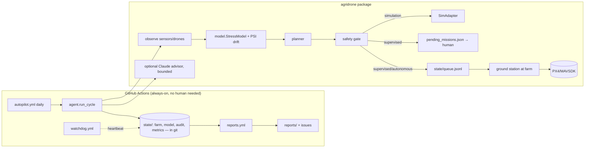

# Architecture

| PRD item | Status here |
|---|---|
| Crop health monitoring | ✅ simulated NDVI/moisture/pest + classifier |
| Drone coordination | ✅ multi-drone, multi-sortie planner (cheapest insertion + 2-opt, battery swaps, forecast-aware, no-fly detours); altitude-layer separation |
| Safety/compliance | ✅ no-fly cells **and flight legs**, battery reserve, kill switch, audit log, policy validation |
| Adaptive ML pipeline | ✅ drift (PSI) + accuracy-triggered retraining, canary promote |
| LLM command & control | ✅ bounded advisor (optional); flight commands never LLM-originated |
| Reports | ✅ weekly/monthly, auto-published as issues |
| Dashboard | ✅ static `docs/dashboard.html` (KPIs, NDVI heatmap, audit feed), regenerated each cycle; Mapbox/React UI later |
| Real drones | 🟡 PX4/MAVSDK adapter + unattended ground station built and unit-tested with a fake vehicle; validated on PX4 SITL, **not yet on real hardware**; payload stubbed (docs/GROUND_STATION.md) |
| Edge IoT / real imagery | ⏳ needs hardware |
| AWS/K8s/Terraform | ⏳ deliberately not provisioned (cost + credentials); Dockerfile is ready |

## Path to production
1. Hardware pilot (1 km²) with a PX4 adapter in `supervised` mode.
2. Replace `sim.py` observations with real multispectral ingestion; replace the logistic model with a PyTorch/ONNX CNN behind `StressModel`'s interface.
3. Containerise (Dockerfile) → EKS/GKE via Terraform once a human approves spend.
4. Regulatory: drone operations (FAA Part 107/137 or local), pesticide-application rules.

## Honest limits
Yield/water/chemical figures are **simulator outputs**, not field evidence. The 20–30% yield and 30–50% savings goals are unvalidated until a real pilot.

## Model quality notes (stress classifier)
Measured with `scripts/eval_model.py` (60 days x 5 seeds, scored against the *whole field*, not the agent's own sample):

| | before | after |
|---|---|---|
| mean balanced accuracy | 0.75 | 0.91 |
| worst outbreak-day recall | 0.00 (missed every stressed cell) | 0.60 |
| pooled recall | n/a | 0.92 |

Root causes fixed: one-class cold start (a model that learned "everything is fine" scored 100%); evaluating on training data;
plain accuracy rewarding never flagging anything; rare positives evicted by a FIFO buffer; a linear model that cannot represent
"too dry OR too infested"; a shortcut on raw NDVI (it trends up with crop growth, now NDVI anomaly vs field median);
a stale evaluation set that hid the problem; and a planner that depended on the model (thresholds now always act).
Honest ceiling: sensor noise (+-0.02) at the decision thresholds limits any detector to ~0.885 balanced accuracy in this
simulator, so the 90% target sits at the noise limit. Labels in the simulator come from the same threshold rule as the
seed set, so real agronomist labels will be harder.

## Benchmark
`scripts/benchmark.py`: 120-day season, 576 patches, 6 random farms. Every strategy sees **identical weather** (environment and
sensor noise use separate random streams), so differences come only from what each strategy does. Yield index 1.00 = no crop loss.

| Strategy | Yield | Water (mm/patch) | Sprays/patch |
|---|---|---|---|
| Do nothing | 87.9% ± 6.4 | 0 | 0.0 |
| Fixed schedule | 100.0% ± 0.0 | 612 | 8.0 |
| AI agent, rules only | 99.7% ± 0.1 | 122 | 0.56 |
| AI agent, 1 flight/day | 96.0% ± 4.2 | 66 | 0.69 |
| AI agent, 3 flights/day | 99.7% ± 0.1 | 126 | 0.62 |

- The AI crew keeps **99.7% of the fixed schedule's yield with ~79% less water and ~92% fewer sprays**; doing nothing loses ~12% of the crop.
- **Capacity matters:** one flight/day per drone cannot keep up with a dry spell (96% yield); with battery swaps (3 flights/day) a 3-drone fleet reaches the plateau (backlog -> ~0).
  Beyond that, yield no longer improves with more drones.
- **The ML model adds almost nothing here** (+0.04 yield points over plain threshold rules; better on 6/6 farms). In this simulator stress *is* a clean threshold on the same sensors.
  Its value would appear where stress is not a simple threshold; that cannot be shown without real data. The rules always act regardless of the model (fail-safe).
- **Sensor faults (4% of sensors dead/stuck/biased/spiking):** without the quality layer the fleet wastes ~29% extra water (184 vs 131 mm) for no yield benefit.
  Detector recall (`scripts/eval_quality.py`): dead 1.00, stuck 0.98, spiking 0.79, **biased 0.53** (a persistent offset is hard to tell from irrigation/soil variation
  without a second sensor or scouting measurements), false alarms 0.02%.
- Action thresholds are the farmer's water-vs-yield knob (`scripts/sweep_thresholds.py`): acting at 0.30 moisture / 0.45 pests (just before damage starts) reaches 0.997 yield; more eager settings buy ~0.1% yield for 25% more water.

### Limits of these numbers
Simulator physics are simplified (single crop, one soil layer, no wind/disease/hail, drone treatment instantly effective). Weather is a synthetic seasonal generator unless
`weather.source` is `open-meteo`. Sensor noise (+-0.02 at decision thresholds) caps any detector at ~0.885 balanced accuracy. **None of this is field evidence.**

## Reliability & engineering
- Policy is schema-validated on every load; the autopilot runs the test suite first, validates policy, runs the cycle, **verifies state integrity before committing**, and opens an incident issue on failure.
- Versioned state migration (`state/version.json`): a simulator upgrade archives old state instead of silently mixing models.
- CI: ruff lint + format, tests on Python 3.11/3.12/3.13 with an 85% coverage gate (currently 95%), bandit (medium+ fails), pip-audit, Docker build + run as non-root.
- Planner: incremental insertion cost with cached leg costs; 300+ candidate patches planned in ~0.5 s.
